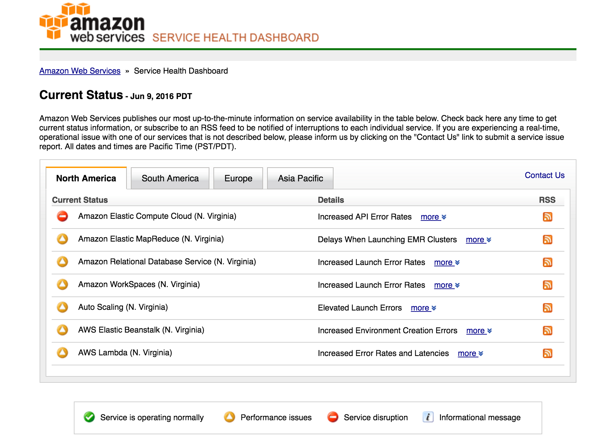

# real-aws-status

Modifies the aws status page such that it *actually* shows the status of services.

# usage

- Download the latest release from the [releases page](https://github.com/josegonzalez/real-aws-status/releases)
- Drag the release to your Chrome browser and install
- Enjoy

# how does it work?

- Grabs all the rows in the status table
- Deletes the rows if the status image is "a-okay"
- Increments the status image in all other cases (except when AWS already says a service is down)
